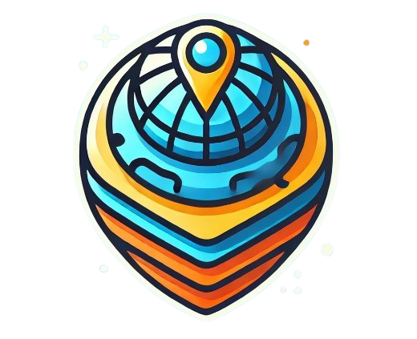
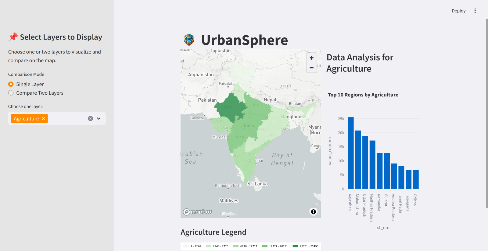
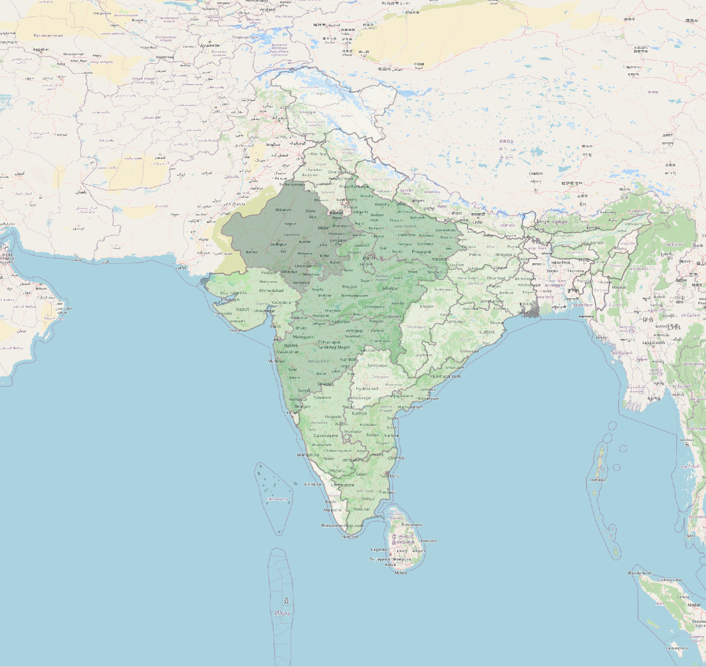
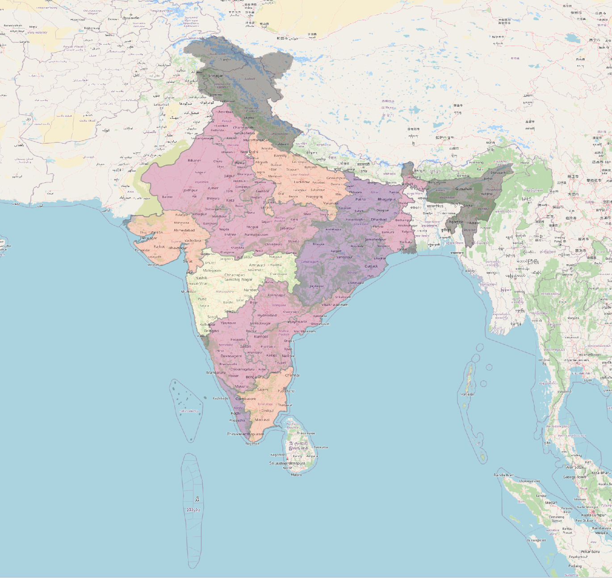
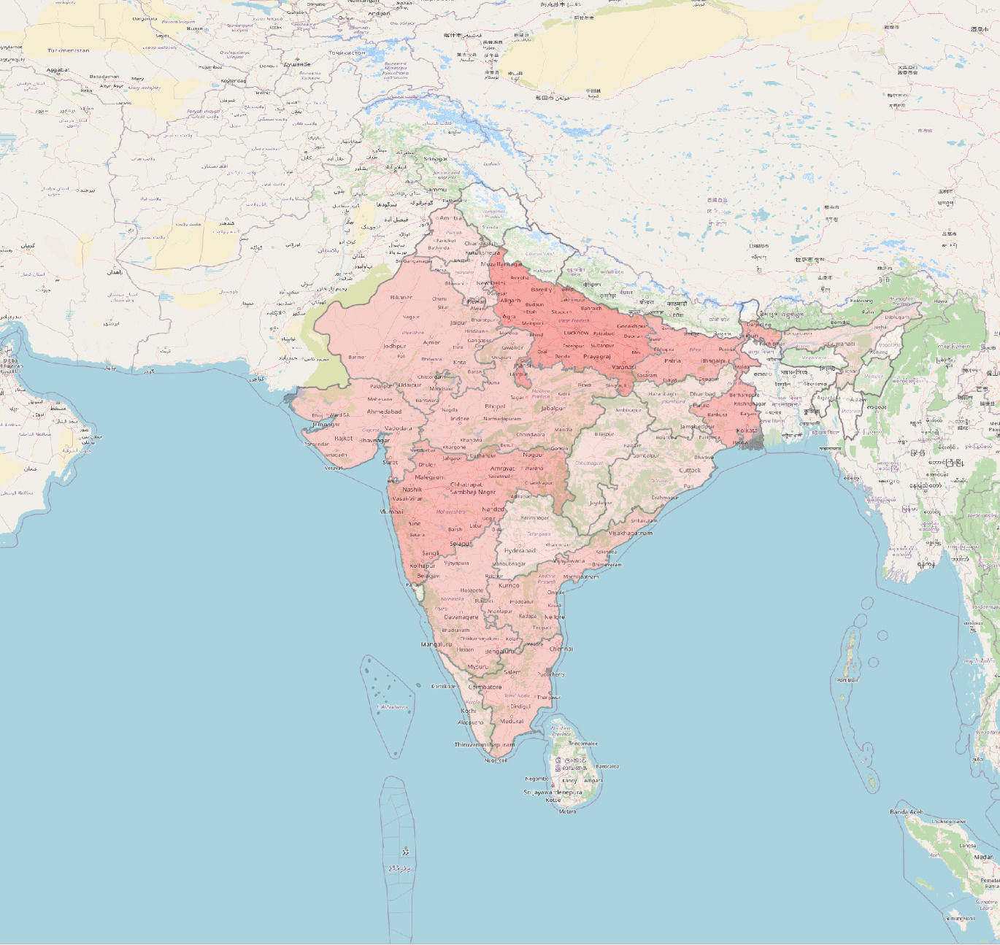
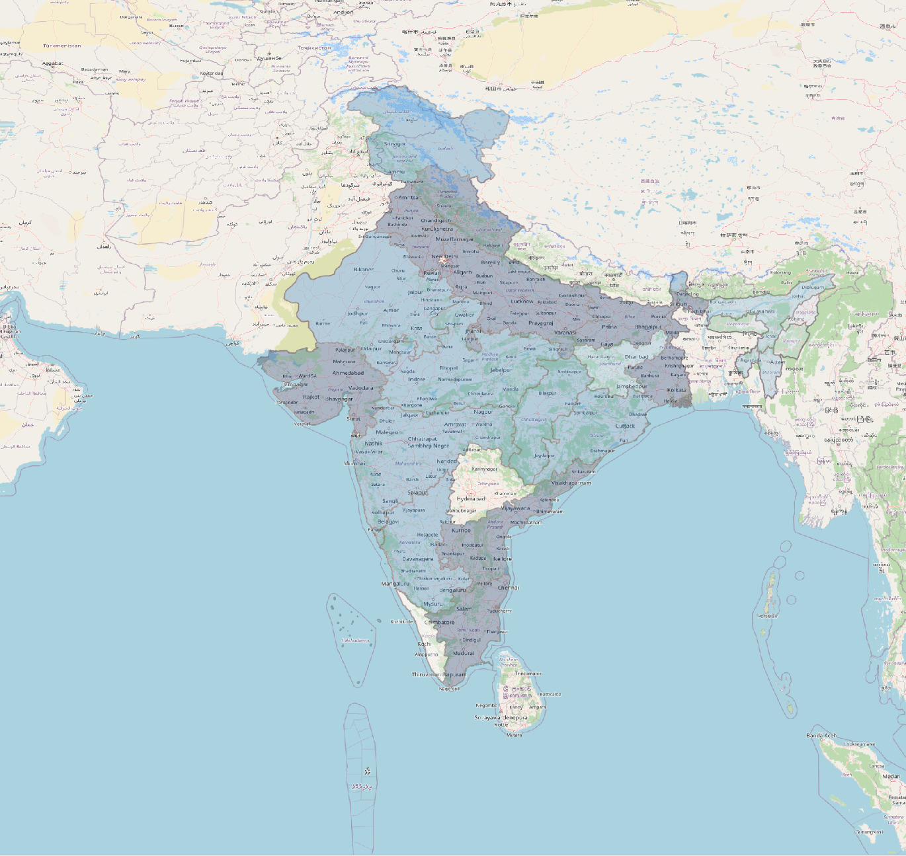

#  UrbanSphere
### the working prototype is app7v2.py
**UrbanSphere** is a project developed for a hackathon that focuses on mapping community assets in India to foster engagement and sustainable growth. Our primary goal is to visualize critical data related to environmental and community resources through interactive choropleth maps.

## Project Overview
In this project, we are creating five choropleth maps that represent the following datasets for each state in India:
- **Air Quality**
- **Safe Drinking Water**
- **Electricity Consumption**
- **Population**
- **Agricultural Land**

These maps aim to provide early access to local information, enabling better decision-making, identifying needs and opportunities, and facilitating communication within communities.

## Technologies Used

- **Mapping Tools**: QGIS
- **Programming Languages**: Python
- **Libraries**: Matplotlib, Folium, Pandas
- **Web Framework**: Streamlit

## Project Maps

    <table>
        <tr>
            <td align="center">
                
                
<strong>Agricultural Land</strong>

            </td>
            <td align="center">
                
                
<strong>Electricity Consumption</strong>

            </td>
        </tr>
        <tr>
            <td align="center">
                
                
<strong>Population</strong>

            </td>
            <td align="center">
                
                
<strong>Safe Drinking Water</strong>

            </td>
        </tr>
    </table>

## Features

- **Interactive Maps**: Users can zoom in, select different maps, and overlap them to gain a comprehensive view of community assets.
- **Periodic Data Updates**: We plan to update the datasets periodically to ensure users have access to the latest information.

## Challenges

One of the significant challenges we face is accessing reliable datasets for the various metrics we aim to map.

## Team Members

The project is developed by **Team Kaizen**, consisting of:
- Devansh
- Rashmin
- Meenal
- Aman
